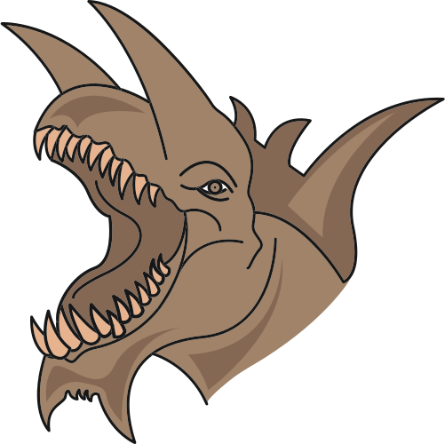

  
  <h1 style="margin-bottom: 0;">Tarrasque App</h1>
  
1.0.0-alpha

> **Warning**
> This project is in alpha and is not yet ready for public use. Please do not use this in production or with real data. We are not responsible for any data loss or other issues that may occur.

Tarrasque App is a free and open-source virtual tabletop software for playing Dungeons & Dragons. It allows you to create and manage your own campaigns, maps, and characters, and provides a simple and intuitive interface for playing D&D online or in-person.

## Requirements

- [Node.js](https://nodejs.org/en/) (v14.17.0 or higher)
- [Yarn](https://yarnpkg.com/) (v1.22.10 or higher)
- [Docker](https://docs.docker.com/get-docker/) (v20.10.7 or higher)
- [Docker Compose](https://docs.docker.com/compose/) (v1.29.2 or higher)

## Installation

To install Tarrasque App, run the following commands to install the dependencies and set up the environment variables:

    ./bin/setup.sh
    cp .env.example .env

Then, edit the `.env` file to set the necessary environment variables.

## Running the Server

To start the development server, run:

    tarrasque docker up

This will start the server at `http://localhost`.

To start the production server, run:

    tarrasque docker up --prod

This will start the production server at `http://localhost`.

## Database Management

To create the database, run:

    yarn server prisma db push

To generate the Prisma client types, run:

    yarn server prisma generate

To create a database migration, run:

    yarn server prisma migrate dev --name <migration-name>

To browse the database using Prisma Studio, run:

    yarn server prisma studio

## Contributing

Contributions are welcome! Please see the [CONTRIBUTING](CONTRIBUTING.md) file for more information. If you have any questions, feel free to reach out to us on [Discord](https://tarrasque.app/discord). We'd love to hear from you! 😊

## License

Tarrasque App is licensed under the GNU Affero General Public License. See the [LICENSE](LICENSE) file for more information.
